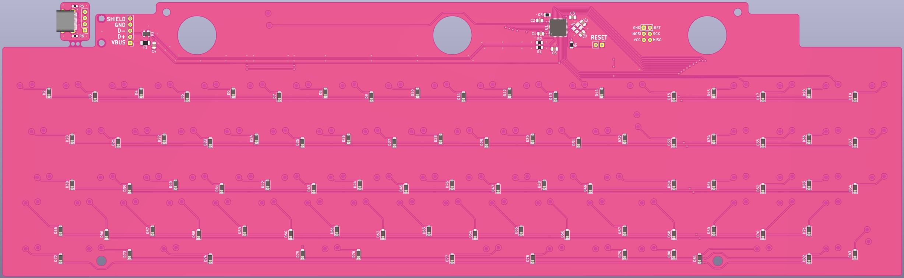
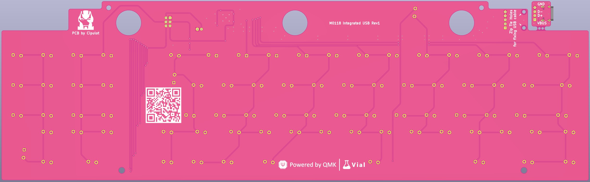
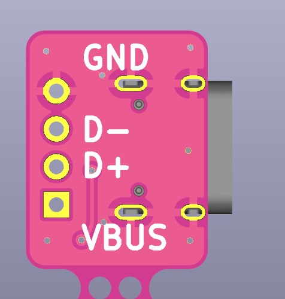
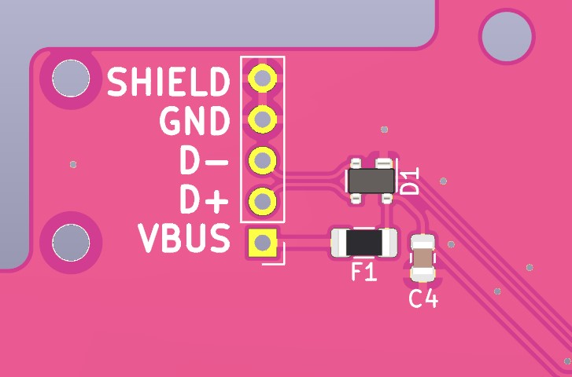
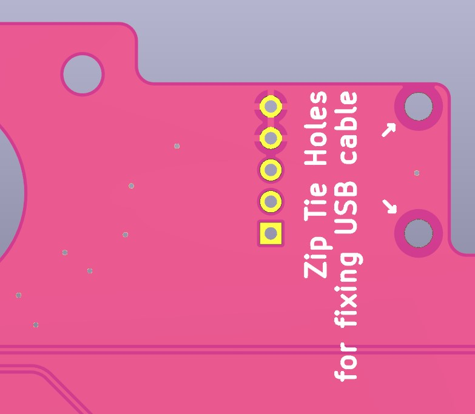

# m0118_integrated_usb

Drop-in replacement USB-C PCB for the Apple M0118 powered by QMK and VIAL.

## Daughterboard
The board comes with a snappable daughterboard with onboard USB-C. To avoid extra costs no connector is used. Istead the user will solder wires accordingly to the pin correspondence (marked on the PCB).

## Internal Wire
Internal wiring of a USB cable is possible. For this reason 2 holes on the pcb are available to the user. You can use them to tie down the cable using a zip tie for added stability.

An extra pin is provided, the `Shiled` pin. This is electrically connected to the board GND and it's solely used to avoid clipping the shielding wire off from the cable (if present at all).

### hahahahaha funny QR
